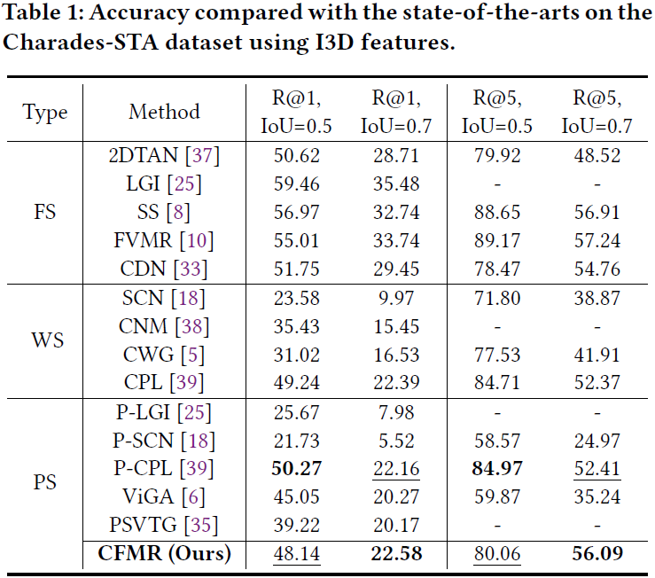
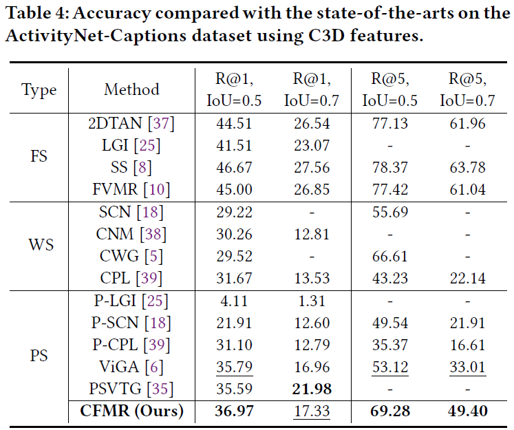
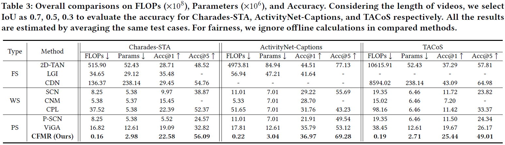

# Introduction

This is our **MindSpore** implementation codes of *"Faster Video Moment Retrieval with Point-Level Supervision"* (CFMR).

## Re-Glance Networks

  In this work, we propose a novel method termed Cheaper and Faster Moment Retrieval (CFMR) to well balances the retrieval accuracy, efficiency, and annotation cost for Video Moment Retrieval task.  
  It learns from point-level supervision where each annotation is a single frame randomly located within the target moment.  
  Such rough annotations have been proved to be 6 $\times$ cheaper than the conventional annotations of event boundaries.  
  Moreover, our CFMR method bypass the usage of complicated cross-modal interaction modules during the inference process, remarkably improving retrieval efficiency.  
  It significantly accelerates the retrieval speed with more than 100 $\times$ FLOPs compared to existing approaches with point-level supervision.  
  We evaluate the proposed CFMR method on three widely used VMR benchmarks, i.e., Charades-STA, ActivityNet-Caption, and TACoS.  
  The experimental results demonstrate our method establishes new state-of-the-art with point-level supervision.  


<!-- **Insight of Our Work** -->
## Insight of Our Work

1. We propose a novel Cheaper and Faster Moment Retrieval method that tackles the PS-VMR problem. It is simple but efficient and achieves a fair trade-off among the accuracy, efficiency, annotation cost for VMR.  
2. We deploy a Point-guided Contrastive Learning module in our model, which effectively utilizes point-level supervision to guide the model to discriminate the semantics hidden in video and text modalities.  
3. We design a Concept-based Multimodal Alignment module that avoids online cross-modal interactions widely used in previous methods. It allows higher efficiency and saves massive computational resources.  
4. Our CFMR method outperforms recent state-of-the-art PS-VMR approaches. Compared with the FS-VMR methods, it also achieves competitive performance on several metrics with much cheaper annotation costs.  

# Data Preparation  

We employ pre-trained I3D model to extract the Charades-STA features, while C3D models to extract the ActivityNet-Caption and TACoS features.  
For now we provide the config file on the TACoS dataset.
You can follow the previous counterpart methods which have been published to deploy the off-the-shelf features.  
Please remember to pack them into hdf5 file and modify the feature path in our config files:  

```Json
"feature_path": "path_to_hdf5_files/extracted_features.hdf5",
```

# Training and Testing

## Running

Please use the following command to train our model:  (debug请用如下指令)

```Python
## Charades-STA
CUDA_VISIBLE_DEVICES=1 python train_ms.py --config-path config/charades/i3d_debug.json --tag CFMR --log ./log/charades/


If you want to evaluate a pre-trained model, please use the following command:

```Python
python train_ms.py --config-path config/charades/i3d.json --tag CFMR --log ./log/charades/ --resume $checkpoint/charades/model-best.pt$ 
```


# Comparisons on Accuracy and Efficiency of Video Moment Retrieval

<!-- **Results on Charades-STA Dataset** -->
## Results on the Charades-STA Dataset



<!-- **Results on TACoS Dataset** -->
## Results on the TACoS Dataset


<!-- **Results on ActivityNet-Caption Dataset** -->
## Results on the ActivityNet-Caption Dataset



## Comparisons on Model Efficiency



<!-- **Visualization of What Our Model Care** -->
## Visualization of Moment Retrieval Results and Time Consumption


